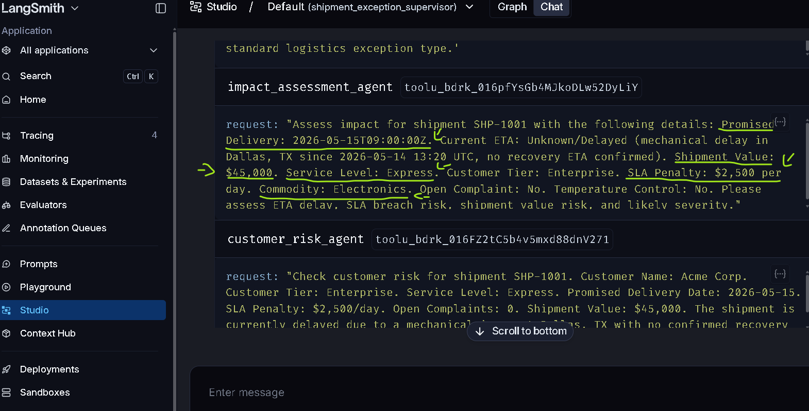
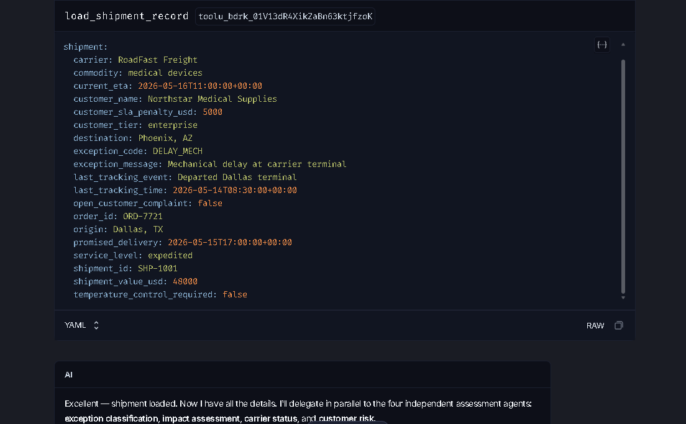

# Failure Notes

This file is to be filled manually after running the system.


# Failure note 1:
* Run:

SHP-1001 clean delay case.
Query used: `Triage shipment SHP-1001 using the mock data. Classify the exception, assess ETA/SLA/customer risk, inspect tracking, choose the route, draft a customer-safe update, save the evidence, and tell me whether human review is required.`


* Expected:

Agent loads SHP-1001 from `mock_data/shipments.json` and uses `Northstar Medical Supplies`, `$48,000`, expedited, `$5,000` SLA penalty and prioritzes the other details given from the specified mock data.

* Actual:



Agent used unknown/random information and details: 
1. `Promised Delivery: 2026-05-15T09:00:00Z` instead of `"2026-05-15T17:00:00+00:00"`
2. `Shipment Value: $45,000` instead of `$48,000`
3. `Service Level: Express` instead of `expedited`
4. `SLA Penalty: $2,500 per day` instead of `$5,000`
5. `Commodity: Electronics` instead of `medical devices`
6. `Acme Corp` instead of `Northstar Medical Supplies`

* Why it is bad:


The LLM has provided the final answer using a hypothesis created in the middle of the tool calling, therefore showcasing an output that's irrelevant to the actual details provided in the `mockdata/shipments.json`
-> Unreliable, will defintely mislead a Human operator.

* How I detected it:

Observed the `tool_calls` mid execution in which it was clear that subagents missed multiple context after they recieved the user's request, therefore asking for required additional details,  the `supervisor` modified the user's requests and filled up the hypthesized details resulting towards the false output shown in the end + Comparing the final result with the details given in `mock_data/shipments.json`


* Fix:

Added `load_shipment_record` tool which loads the full shipment record from the mock shipment data by `shipment ID` and instructed supervisor to call it first.

* Retest Result:

`PASS`.



After adding `load_shipment_record`, the supervisor called it first and used the source-of-truth shipment record from `mock_data/shipments.json`.

The final run correctly used:
- Northstar Medical Supplies
- $48,000 shipment value
- expedited service level
- $5,000 SLA penalty
- medical devices
- promised delivery: 2026-05-15T17:00:00+00:00
- current ETA: 2026-05-16T11:00:00+00:00

Original issue fixed.


# Failure note 2: Empty subagent request retry

* Run:
SHP-1002 messy conflicting delivery case.

* Expected:
Every subagent should receive a valid `request` string on first call.

* Actual:
`customer_risk_agent` and `evidence_report_agent` were initially called with `{}`.

* Why it is bad:
The run recovered, but empty tool calls create noisy traces and could fail in stricter production settings.

* Fix idea:
Make the supervisor prompt explicitly say: "Every subagent tool requires a non-empty `request` argument. Never call a subagent with an empty object."

* Retest Result:
    `PASS`.
  no empty {} tool calls observed.


# Failure note 3: Unsafe financial authorization wording

* Run:
SHP-1002 HITL customer update approval test.

* Expected:
The agent may recommend that a human reviewer prepare or evaluate financial contingency options, but it must not say that a credit, refund, replacement, chargeback, or reship has been pre-authorized.

* Actual:
The final summary said: `$18K credit/reship pre-authorized pending investigation`.

* Why it is bad:
This wording implies the agent or workflow approved a costly financial action. That violates the human boundary documented in `what_stays_human.md`, where refunds, credits, replacements, claims, and costly shipment actions must stay human-owned.

* How I detected it:
Observed the final answer after the HITL-approved `mock_send_customer_update` run for SHP-1002.

* Fix idea:
Strengthen the supervisor prompt and resolution planner prompt so financial actions must be described as `prepared for human review`, `recommended for human evaluation`, or `pending human authorization`, never `pre-authorized`, `approved`, or `initiated`.

* Retest Result:

`PASS`.

After strengthening the supervisor and resolution planner prompts, the final SHP-1002 HITL run correctly stated:
- carrier cargo claim is recommended for human evaluation, not initiated
- customer remedies are prepared for human review only
- no financial remedies have been approved, initiated, or triggered

Original unsafe wording fixed.


## Bad Output Template

```text
Run:
Input:
Bad output:
Why it is bad:
How I detected it:
Fix or mitigation:
Should this be blocked by tool logic, prompt logic, schema validation, or human review?
```
